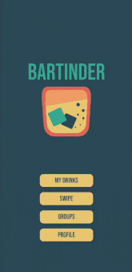

<h1>
BarTinder

</h1>

Curate a personalised list of cocktails and see matches with friends.

Made for bartenders and drinkers alike!

BarTinder lets drinkers decide what they want to drink before getting to the bar and helps bartenders know what to make for their illustrious cocktail parties they'll be throwing! 🍸 🥃

  

## Tech Stack

- [React Native](https://reactnative.dev/)
- [Expo](https://expo.io/)
- [Node.js](https://nodejs.org/)
- [Express](https://expressjs.com)
- [Sequelize](https://sequelize.org/)
- [The Cocktail DB](https://www.thecocktaildb.com/api.php)

## Getting started

Get yourself setup with your favourite code editor, a local Postgres DB running on your machine, expo for your phone and setup an account with The Cocktail DB or use the free version of their API

1. Fork and clone the repo onto your computer

2. Create a .env file in /client with the following: API_URL, API_KEY (if you're paying for the API) and SERVER_URL

3. Create a .env file in /server with your DB credentials and edit server/models/index.js to suit

4. `cd server && npm i && nodemon`

5. `cd client && npm i && expo start`

## Currently developing...

- Redux on the front end (checkout redux branch)
- Refactoring the back end to cleaner and more readable code
- More effectivley utilising sequelizes capabilities

## Room For Improvement

- Choose what type of drinks you would like to swipe on such as non-alcoholic, beer, punch etc...
- The ability to add friends
- Add an events page for parties
- Authorization and/or facebook/google login
